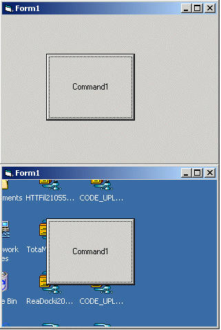

<div align="center">

## Invisible Form


</div>

### Description

This code will simply allow you to create a form which is clear, meaning you can only see the controls on the form, and everything else will appear as whatever ur form is covering up. The best thing about this code is that if you click on an area of the form which has no controls, and is transparent, then it will take you to that window. MAKE SURE YOUR FORM SCALEMODE IS PIXELS
 
### More Info
 
NAH

NOP-E

CLEAR STUFF

BRAIN FREEZE


<span>             |<span>
---                |---
**Submitted On**   |
**By**             |[Austin Agarwal](https://github.com/Planet-Source-Code/PSCIndex/blob/master/ByAuthor/austin-agarwal.md)
**Level**          |Beginner
**User Rating**    |4.9 (49 globes from 10 users)
**Compatibility**  |VB 5\.0, VB 6\.0
**Category**       |[Custom Controls/ Forms/  Menus](https://github.com/Planet-Source-Code/PSCIndex/blob/master/ByCategory/custom-controls-forms-menus__1-4.md)
**World**          |[Visual Basic](https://github.com/Planet-Source-Code/PSCIndex/blob/master/ByWorld/visual-basic.md)
**Archive File**   |[](https://github.com/Planet-Source-Code/austin-agarwal-invisible-form__1-24105/archive/master.zip)

### API Declarations

JUST PASTE THE CODE INTO A MODULE


### Source Code

```
Option Explicit
Private Declare Function CreateRectRgn Lib "gdi32" (ByVal X1 As Long, ByVal Y1 As Long, ByVal X2 As Long, ByVal Y2 As Long) As Long
Private Declare Function CombineRgn Lib "gdi32" (ByVal hDestRgn As Long, ByVal hSrcRgn1 As Long, ByVal hSrcRgn2 As Long, ByVal nCombineMode As Long) As Long
Private Declare Function SetWindowRgn Lib "user32" (ByVal hWnd As Long, ByVal hRgn As Long, ByVal bRedraw As Long) As Long
Public Sub GlassifyForm(frm As Form)
Const RGN_DIFF = 4
Const RGN_OR = 2
Dim outer_rgn As Long
Dim inner_rgn As Long
Dim wid As Single
Dim hgt As Single
Dim border_width As Single
Dim title_height As Single
Dim ctl_left As Single
Dim ctl_top As Single
Dim ctl_right As Single
Dim ctl_bottom As Single
Dim control_rgn As Long
Dim combined_rgn As Long
Dim ctl As Control
  If frm.WindowState = vbMinimized Then Exit Sub
  ' Create the main form region.
  wid = frm.ScaleX(frm.Width, vbTwips, vbPixels)
  hgt = frm.ScaleY(frm.Height, vbTwips, vbPixels)
  outer_rgn = CreateRectRgn(0, 0, wid, hgt)
  border_width = (wid - frm.ScaleWidth) / 2
  title_height = hgt - border_width - frm.ScaleHeight
  inner_rgn = CreateRectRgn( _
    border_width, _
    title_height, _
    wid - border_width, _
    hgt - border_width)
  ' Subtract the inner region from the outer.
  combined_rgn = CreateRectRgn(0, 0, 0, 0)
  CombineRgn combined_rgn, outer_rgn, _
    inner_rgn, RGN_DIFF
  ' Create the control regions.
  For Each ctl In frm.Controls
    If ctl.Container Is frm Then
      ctl_left = frm.ScaleX(ctl.Left, frm.ScaleMode, vbPixels) _
        + border_width
      ctl_top = frm.ScaleX(ctl.Top, frm.ScaleMode, vbPixels) _
        + title_height
      ctl_right = frm.ScaleX(ctl.Width, frm.ScaleMode, vbPixels) _
        + ctl_left
      ctl_bottom = frm.ScaleX(ctl.Height, frm.ScaleMode, vbPixels) _
        + ctl_top
      control_rgn = CreateRectRgn( _
        ctl_left, ctl_top, _
        ctl_right, ctl_bottom)
      CombineRgn combined_rgn, combined_rgn, _
        control_rgn, RGN_OR
    End If
  Next ctl
  ' Restrict the window to the region.
  SetWindowRgn frm.hWnd, combined_rgn, True
End Sub
```

